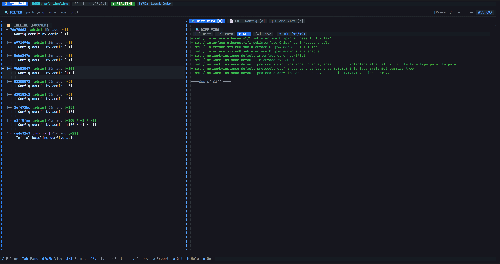

# SR Linux Timeline (`timeline`)

A configuration timeline and version history tool for Nokia SR Linux using Git.

`timeline` automatically tracks configuration changes on Nokia SR Linux switches into an on-box Git repository. It provides an interactive Terminal User Interface (TUI) as the primary way to interact with the switch's history, along with command-line tools to view historical commits, inspect semantic diffs, trace line attribution, restore configurations, and synchronize with remote Git repositories.



---

## Running the Timeline TUI

The primary way to interact with `timeline` is through the visual **Terminal User Interface (TUI)** directly on the SR Linux device.

### From the SR Linux CLI
You can launch the TUI directly from the standard SR Linux CLI prompt using the `bash` command:

```text
--{ running }--[  ]--
A:srl-timeline# bash timeline
```

You can also launch it pre-filtered to a specific subsystem or interface:
```text
A:srl-timeline# bash timeline --filter "interface ethernet-1/1"
```

### From the Linux Bash Shell
If you log into the underlying Linux bash shell on the switch (or connect via SSH), simply run `timeline`:

```bash
# Launch interactive TUI
timeline

# Launch TUI pre-filtered to a specific path
timeline --filter "interface ethernet-1/1"
```

---

## Features

- **Commit History & Visual Timeline**: Automatically records configuration commits with author identity, timestamps, diff statistics, and commit comments.
- **Semantic Configuration Diffs**: Compares revisions structurally in memory. Supports Unified Diff, Path Changes, and flat CLI (`set` / `delete`) formats. Includes a **Live Compare Mode** to diff any past snapshot against the switch's live running configuration.
- **Scoped Path Filtering**: Filter the timeline, diffs, and full configuration to specific subtrees or interfaces (e.g., `interface ethernet-1/1`, `bgp`, `acl`).
- **Configuration Rollback & Cherry-Pick**: Roll back the switch to a past revision or interactively cherry-pick and apply specific configuration subtrees.
- **Configuration Blame**: Line-by-line attribution showing who modified each line or block of configuration and when.
- **Remote Git Synchronization**: Push configuration history to external Git repositories (GitHub, GitLab, etc.) with automated background push on commit.
- **Configuration Export**: Export any historical commit as SR Linux startup JSON (`config.json`) or flat CLI scripts.

---

## TUI Keyboard Shortcuts

| Shortcut | Action |
|---|---|
| <kbd>j</kbd> / <kbd>↓</kbd> | Next commit in timeline |
| <kbd>k</kbd> / <kbd>↑</kbd> | Previous commit in timeline |
| <kbd>Tab</kbd> | Switch focus between Timeline pane and Details pane |
| <kbd>d</kbd> | Switch to **Diff View** |
| <kbd>c</kbd> | Switch to **Full Config View** |
| <kbd>b</kbd> | Switch to **Blame View** |
| <kbd>[</kbd> / <kbd>]</kbd> or <kbd>t</kbd> | Cycle through views (Diff $\rightarrow$ Config $\rightarrow$ Blame) |
| <kbd>1</kbd> / <kbd>2</kbd> / <kbd>3</kbd> | Select sub-formats (Unified, Path Changes, Flat CLI in Diff; CLI, JSON in Config) |
| <kbd>4</kbd> or <kbd>v</kbd> | Toggle **Live Compare Mode** (Revision vs Live Running Config) |
| <kbd>/</kbd> | Focus search / path filter bar |
| <kbd>Esc</kbd> | Clear filter / close modal |
| <kbd>r</kbd> | Open **Restore Modal** (Full configuration rollback) |
| <kbd>p</kbd> | Open **Cherry-Pick Modal** (Interactive subtree restore) |
| <kbd>e</kbd> | Open **Export Modal** (Save to file or startup config) |
| <kbd>g</kbd> | Open **Remote Git Settings Modal** |
| <kbd>?</kbd> | Display Help dialog |
| <kbd>q</kbd> | Quit application |

---

## Installation & Building

### Option 1: Download & Copy Pre-compiled Binary

1. **Download the binary**:
   Download the latest static Linux binary (`timeline`) from the [GitHub Releases](https://github.com/andywhitaker/srl-timeline/releases/latest) page on your local workstation.

2. **Copy the binary to the switch via SCP**:
   From your local machine, copy the binary to `/tmp` on the SR Linux switch:
   ```bash
   scp timeline admin@<switch-ip>:/tmp/timeline
   ```

3. **Install and set executable permissions on the switch**:
   - **From the SR Linux CLI**:
     ```text
     --{ running }--[  ]--
     A:srl-timeline# bash sudo mv /tmp/timeline /usr/local/bin/timeline
     A:srl-timeline# bash sudo chmod +x /usr/local/bin/timeline
     ```
   - **From the Linux Bash Shell** (if logged into bash directly):
     ```bash
     sudo mv /tmp/timeline /usr/local/bin/timeline
     sudo chmod +x /usr/local/bin/timeline
     ```

> **Tip**: If your SR Linux switch has direct outbound internet access, you can download and install it in a single command on the switch:
> ```bash
> sudo curl -sL https://github.com/andywhitaker/srl-timeline/releases/latest/download/timeline -o /usr/local/bin/timeline && sudo chmod +x /usr/local/bin/timeline
> ```

### Option 2: Build from Source with Go
`timeline` is written in pure Go and compiles to a single static binary with no external runtime dependencies:

```bash
# Clone the repository
git clone https://github.com/andywhitaker/srl-timeline.git
cd srl-timeline

# Compile static binary
CGO_ENABLED=0 go build -ldflags="-s -w" -o bin/timeline .

# Copy to switch via SCP
scp bin/timeline admin@<switch-ip>:/tmp/timeline
```

---

## Lab Deployment

`timeline` uses Git on the switch system to manage configuration versioning.

### 1. Launching the Lab
You can deploy a test lab with Containerlab using the provided topology:

```bash
sudo clab deploy -t timeline.clab.yml
```

### 2. Providing Git to the Container
Because minimal SR Linux container images do not include `git` by default, you can provide `git` using one of the following methods:

- **Method A: Host Bind Mount (Quickest for Labs)**
  Mount your host system's `git` binary and libraries into the container in `timeline.clab.yml`:
  ```yaml
  topology:
    nodes:
      srl-timeline:
        kind: nokia_srlinux
        image: ghcr.io/nokia/srlinux:latest
        binds:
          - bin/timeline:/usr/local/bin/timeline
          - timeline_config.yml:/etc/opt/srlinux/appmgr/timeline_config.yml
          - /usr/bin/git:/usr/bin/git:ro
          - /usr/lib/git-core:/usr/lib/git-core:ro
  ```

- **Method B: Package Installation**
  Install Git directly inside the running container or switch:
  ```bash
  sudo apt update && sudo apt install -y git
  ```

- **Method C: Custom Container Image**
  Pre-install `git` into a custom SR Linux base image.

---

## Command-Line Interface (CLI Commands)

In addition to the interactive TUI, `timeline` provides subcommands for automation, scripting, CI/CD pipelines, or quick queries from the shell:

```bash
# View commit history
timeline log --limit 20
timeline log --filter bgp

# Semantic diff between revisions
timeline diff HEAD~1 HEAD
timeline diff HEAD~2 HEAD --format cli
timeline diff <sha1> <sha2> --filter ethernet-1/1

# Show configuration at a point in time
timeline show HEAD --format cli
timeline show <sha> --format json --filter system

# Line-by-line blame attribution
timeline blame --filter ethernet-1/1

# Full configuration restore
timeline restore <sha> --yes

# Cherry-pick restore specific paths
timeline restore <sha> --path "/interface[name=ethernet-1/1]/description"

# Export configuration
timeline export <sha> --format json --output /tmp/snapshot.json
timeline export <sha> --save-startup

# Remote Git synchronization
timeline remote show
timeline remote key
timeline remote set git@github.com:org/srl-configs.git --auto-push
timeline remote push

# Background recorder daemon management
timeline daemon status
timeline daemon start
timeline daemon stop
```

---

## License

Apache License 2.0
